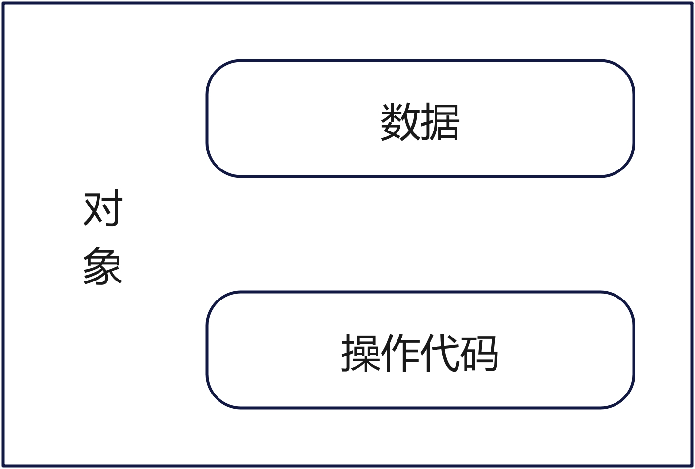
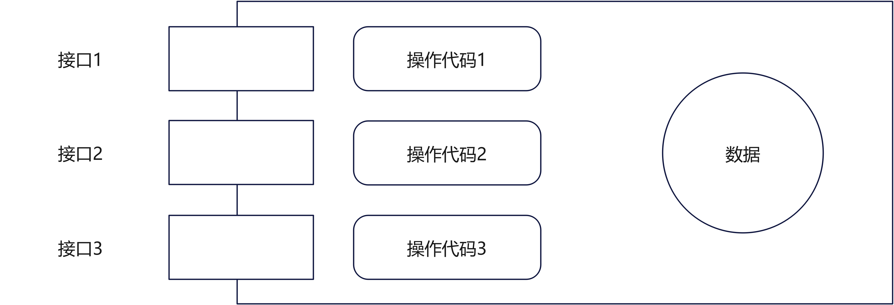

# 第一章 面向对象程序设计概述

## 1.1 什么是面向对象程序设计

### 1.1.1 一种程序设计范型

> 程序设计范型： 设计程序的规范、模型、和风格，是一类型程序设计语言的基础

**面向过程程序设计范型**，**面向对象程序设计范型**是目前主流的两种程序设计范型。

面向过程程序设计： 
> 程序 = 过程 + 调用

面向对象程序设计：
> 程序 = 对象 + 消息

### 1.1.2 面向对象程序设计的基本概念

#### 1. 对象

现实世界中的对象具有以下特性：

（1）每一个对象必须有一个名字以区别于其他的对象；

（2）用属性来描述对象的某些特征；

（3）有一组操作，每组操作决定对象的一种行为；

（4）对象的行为可以分为两类：一类是作用于自身的行为，另一类是作用于其他对象的行为。

面向对象程序设计沿用了上面人们所熟悉的这种思路。

#### 2. 类

现实世界中，**类**是一组具有相同属性和行为的对象的抽象。

**类**和**对象**的关系是抽象和具体的关系。**类**是多个**对象**进行综合抽象的结果，**对象**又是**类**的个体实物，一个**对象**是**类**的实例。

在面向对象程序设计中，**类**就是具有相同的数据和相同的操作（函数）的一组**对象**的集合。

#### 3. 消息与方法

现实世界中，**对象**并不是孤立存在的实体，它们之间存在着各种各样的联系，正是它们之间的相互作用、联系、连接，才构造出世界各种不同的系统。

在面向对象程序设计中，**对象**之间的也存在一定的联系或者交互。**对象**之间的这种交互称之为消息传递。一个**对象**向另一个**对象**发出的请求称之为**消息**。当对象接受到消息时，就调用相关的方法，执行对应的操作。

### 1.1.3 面向对象程序设计的基本特征

#### 1. 抽象

**抽象**是通过特定的实例（**对象**）抽取出共同性质后形成概念的过程。面向对象程序设计中的抽象包括两个方面：**数据抽象**和**代码抽象**。

数据抽象：描述某类对象的属性或状态

代码抽象：描述了某类对象的共同行为特征或具有的共同功能。

#### 2. 封装

**封装**是指把数据和实现操作的代码集中起来放在对象内部，并尽可能屏蔽对象的内部细节

通过下面这幅图更好的理解下封装

**封装**有如下两方面重要含义：

- 将有关的数据和操作代码封装在一个对象中，各个对象相互独立、互不干扰
- 将对象中某些数据与操作代码对外隐蔽（安全）

#### 3. 继承

面向程序设计中，继承所表达的是对象类之间的关系。

若类之间有继承关系，则它们之间具有下列几个特性：
（1）类之间具有共享特征（包括数据和操作代码的共享）
（2）类间具有差别或新增的部分（包括非共享的数据和操作代码）
（3）类间具有层次结构

在面向对象程序设计中，继承的作用有如下两个：

- 避免公用代码重复开发，减少代码和数据冗余
- 通过增强一致性来减少模块间的接口和界面

#### 4. 多态

面向对象系统的多态性是指不同的对象收到相同的消息执行不同的操作。
C++支持两种多态性，即编译时多态与运行时多态

编译时多态：通过函数重载（包括运算符重载）来实现

运行时多态：通过虚函数实现

## 1.2 为什么使用面向对象程序设计

### 1.2.1 传统程序设计的局限性

#### 1. 传统程序设计开发软件的生产效率低下

#### 2. 传统程序设计难以应付日益庞大的信息量和多样的信息类型

#### 3. 传统程序设计难以适应各种新环境

### 1.2.2 面向对象程序设计的主要优点

#### 1. 可提高程序的重用性

#### 2. 可控制程序的复杂性

#### 3. 可改善程序的可维护性

#### 4. 能够更好的支持大型的程序设计

#### 5. 增强了计算机处理信息的范围

#### 6. 能很好的适应新的硬件环境

## 1.3 面向对象程序设计的语言

### 1.3.1 几种典型的面向对象程序设计语言

#### 1. Smalltalk

#### 2. Simula 语言

#### 3. C++语言

#### 4. Java语言

#### 5. C#